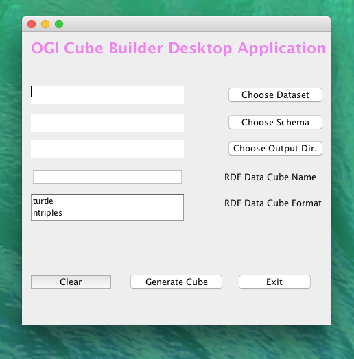
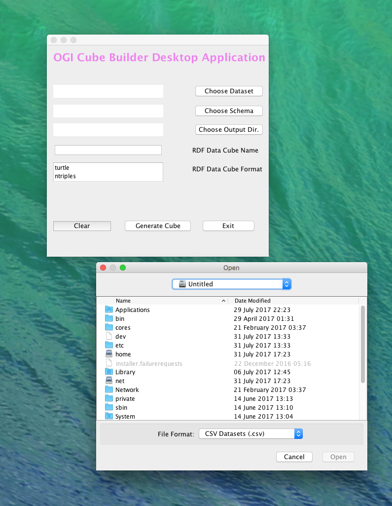
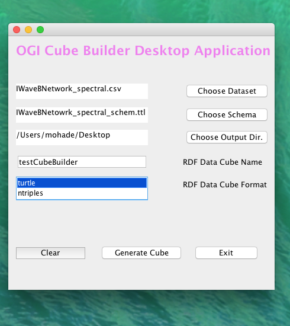
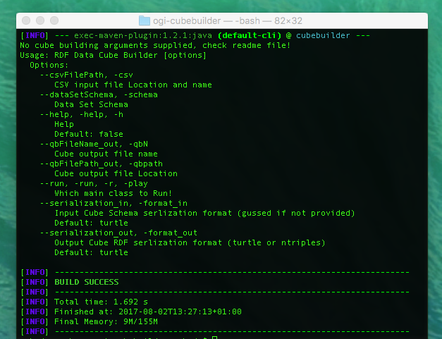

# OGI tools "UNIX syntax"
-------------------------

## Cloning OGI tools

	$git clone https://gitlab.insight-centre.org/egov/ogi-tools.git ogi-cubebuilder

	//You may need to install git -> $sudo apt-get install git

	$sudo chmod 777 -R ogi

	$cd ogi-cubebuilder/

	$git checkout test

## Download and Run Fuseki Server

	Use instructions at:
	> https://jstirnaman.wordpress.com/2013/10/11/installing-fuseki-with-jena-and-tdb-on-os-x/

	(just change the tar.gz locations to):
	(1) https://archive.apache.org/dist/jena/binaries/apache-jena-2.11.0.tar.gz
	(2) https://archive.apache.org/dist/jena/binaries/jena-fuseki-1.0.0-distribution.tar.gz

	$mkdir {user.dir}/jena-fuseki-1.0.0/LinkedcubeSpace

	$sudo screen -S cubeserver ./fuseki-server --port=8080 --update --loc=LinkedcubeSpace /ds

	$curl http://localhost:8080

	$cd ogi-cubebuilder/src/main/resources/

	$nano config.properties (add fuseki port of your choice) // to be deleted when json cube API works

## Download tarql service as library

	$mkdir {base.dir}/ogi-cubebuilder/lib/
	$cd {base.dir}/ogi-cubebuilder/lib/

	$wget --no-check-certificate 'https://github.com/opencube-toolkit/tarql-component/raw/master/lib/extensions/tarql-1.0a.jar' -O tarql-1.0a.jar

	OR

	$curl -L -o tarql-1.0a.jar "https://github.com/opencube-toolkit/tarql-component/raw/master/lib/extensions/tarql-1.0a.jar"  

	$wget --no-check-certificate 'https://github.com/opencube-toolkit/tarql-component/raw/master/lib/extensions/tarql-1.0a-javadoc.jar' -O tarql-1.0a-javadoc.jar

	OR

	$curl -L -o tarql-1.0a-javadoc.jar "https://github.com/opencube-toolkit/tarql-component/raw/master/lib/extensions/tarql-1.0a-javadoc.jar"

	$cd {base.dir}/ogi-cubebuilder/

	$mvn install:install-file -Dfile=lib/tarql-1.0a.jar -DgroupId=org.deri.tarql -DartifactId=tarql -Dversion=1.0a -Dpackaging=jar

	$mvn install:install-file -Dfile=lib/tarql-1.0a-javadoc.jar -DgroupId=org.deri.tarql -DartifactId=tarql-doc -Dversion=1.0a -Dpackaging=jar

	$mvn clean install

## Clone, Configure, build and run jsonCubeAPI service

	$cd {base.dir}/

	$clone .............................. ogi-api

	$cd ogi-api/resources/

	$nano config.prop (Set fuseki/SPARQL server URL, ex: http://localhost:8080/ds/query)

	$cd ogi-api/

	$mvn package

	add to tomcat server, or run using jetty server

## OGI Desktop UI

1- Run OGI UI:

	$cd {base.dir}/ogi

	$mvn exec:java -Dexec.args="--run:desktop"

## OGI Command Line UI

2- Run OGI CMD:

	$cd {base.dir}/ogi-cubebuilder

        $ mvn exec:java -Dexec.args="--run:cmd -csv:~/IWaveBNetwork_spectral.csv -schema:~/IWaveBNetowrk_spectral_output.ttl -qbN:cmdTest.ttl -qbpath:~/Desktop/ -format_in:TURTLE -format_out:TURTLE"

        Usage: RDF Data Cube Builder [options]
          Options:
            --csvFilePath, -csv
               CSV input file Location and name
            --dataSetSchema, -schema
               Data Set Schema
            --help, -help, -h
               Help
               Default: false
            --qbFileName_out, -qbN
               Cube output file name
            --qbFilePath_out, -qbpath
               Cube output file Location
            --run, -run, -r, -play
               Which main class to Run!
            --serialization_in, -format_in
               Input Cube Schema serlization format (turtle or ntriples)
               Default: turtle
            --serialization_out, -format_out
               Output Cube RDF serlization format (turtle or ntriples)
               Default: turtle

## OGI Web Service API

3- Run OGI Web Service API:

	$cd {base.dir}/ogi-cubebuilder

	$mvn exec:java -Dexec.args="--run:webservice"

## Available gates:

	> curl http://localhost:4567/

### cube builder:
	> curl http://localhost:4567/cubeBuilderAPI/cubeBuilderArgs?csv=inputFileNameAndLocation&schema=marineInstituteDatasetId&serialization=turtle&qbPath=outputFileLocation&qbName=outputFileName

### listing available cubes
	> curl http://localhost:4567/cubeQueryingAPI/listLqbs?limit=numberOfRetrievedRecords

### retrieve cube metadata
	> curl http://localhost:4567/cubeQueryingAPI/LqbMeta?dsuri=marineInstituteDatasetURI

### retrieve data of certain cube
	>curl http://localhost:4567/cubeQueryingAPI/listdataofLqb?dsuri=marineInstituteDatasetURI&limit=numberOfRetrievedRecords

### sparql endpoint
	>curl http://localhost:4567/cubeQueryingAPI/cubeQueryingArgs?query=sparqlQueryToExecuteAgainstLinkedCubeSpace

# Examples:

## Download example csv file

	$cd {base.dir}/ogi-cubebuilder/src/main/resources/

	$mkdir data output

	$cd {base.dir}/ogi-cubebuilder/src/main/resources/data

	$wget --no-check-certificate 'https://drive.google.com/uc?export=download&id=0B-DxlQVxO6pnNkZwY3k2ZE5NNFE' -O IWBNetwork.csv

	$cd {base.dir}/ogi-cubebuilder/

### Build Linked Cube

	A- Using Command Line UI

                $ mvn exec:java -Dexec.args="--run:cmd -csv:~/IWaveBNetwork_spectral.csv -schema:~/IWaveBNetowrk_spectral_output.ttl -qbN:cmdTest.ttl -qbpath:~/Desktop/ -format_in:TURTLE -format_out:TURTLE"

	B- Using Web Service API

		$mvn exec:java -Dexec.args="-run:webservice"

	From web browser:

	> http://localhost:4567/cubeBuilderAPI/cubeBuilderArgs?csv=/ogi-CubeSchema-creator/example_1/IWaveBNetwork_spectral.csv&schema=/ogi-cubebuilder/src/main/resources/IWaveBNetowrk_spectral_output.ttl&serializationIn=TURTLE&serializationOut=TURTLE&qbPath=/ogi-cubebuilder/test_output/&qbName=webtest.ttl
### Load Linked Cube to Running fuseki server from cmd

	$cd {fuseki.dir}

	$wget --no-check-certificate 'https://drive.google.com/uc?export=download&id=0B-DxlQVxO6pnVjluN1FQa09aams'-O IWBNetwork.ttl

	$./s-put http://localhost:8080/ds/data default IWBNetwork.ttl

#### in case java 8 is not installed
http://www.tecmint.com/install-java-jdk-jre-in-linux/

#### incase mvn 3.3.9 not installed
https://javedmandary.blogspot.ie/2016/09/install-maven-339-on-ubuntu.html

Sample Screens:
===============
Cube Builder Desktop UI

Cube Builder CMD

Last Update:
============
10 May 2017
